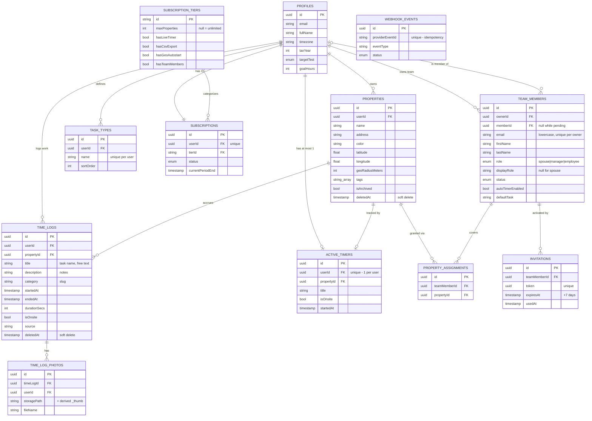

# Host Hours — Data Model Reference

A quick-reference companion to [TECHNICAL_DESIGN.md](./TECHNICAL_DESIGN.md). The big doc has full field-by-field tables and the rules; **this file is the at-a-glance map** — an ERD plus a one-line-per-entity summary, the enums, and the constraints/indexes a fresh build must enforce.

Field names are abstract/camelCase (adapt to your stack). "Soft delete" = a `deletedAt` timestamp that hides the row but retains it.

---

## Entity-Relationship Diagram

> Renders in GitHub and the VS Code Markdown preview (Mermaid). An ASCII fallback follows below.



**ASCII fallback:**

```
                         ┌──────────────────┐
                         │ SUBSCRIPTION_TIERS│  (catalog: free/professional/enterprise)
                         └─────────┬─────────┘
                                   │ categorizes
                                   ▼
   ┌─────────────┐  has 1  ┌──────────────┐
   │ SUBSCRIPTIONS│◀───────│              │
   └─────────────┘         │   PROFILES   │ (User / account principal)
                           │              │
   owns ┌──────────────────┼──────┬───────┼───────────────┐ defines
        ▼                  ▼      │       ▼                ▼
  ┌───────────┐     ┌────────────┐│  ┌─────────────┐  ┌───────────┐
  │ PROPERTIES│     │ ACTIVE_TIMERS│  │  TIME_LOGS  │  │ TASK_TYPES│
  └─────┬─────┘     └──────────────┘  └──────┬──────┘  └───────────┘
        │ accrues / granted-via             │ has
        │                                    ▼
        │                            ┌────────────────┐
        │                            │ TIME_LOG_PHOTOS│
        │                            └────────────────┘
        │
        │            owns team ┌──────────────┐  is-member ┌──────────┐
        │  ┌──────────────────▶│ TEAM_MEMBERS │◀───────────│ PROFILES │
        │  │                   └──────┬───────┘             └──────────┘
        ▼  │ covers                   │ activated by
  ┌────────┴───────────┐             ▼
  │ PROPERTY_ASSIGNMENTS│      ┌─────────────┐
  └────────────────────┘      │ INVITATIONS │
                              └─────────────┘

  WEBHOOK_EVENTS  (standalone: payment idempotency ledger)
```

---

## Entity quick reference

| Entity | Purpose | Key fields | Constraints / indexes | Soft-delete |
|---|---|---|---|---|
| **profiles** | The user/account record | `id`, `email`, `timezone`, `taxYear`, `targetTest`, `goalHours` | id = auth id | — |
| **subscription_tiers** | Plan catalog (seeded) | `id`, `maxProperties`, feature flags, prices | public read | — |
| **subscriptions** | A user's current plan | `userId`, `tierId`, `status`, period dates | **unique `userId`**; idx by user | — |
| **properties** | A rental unit | `userId`, `name`, `address`, `color`, `lat/long`, `geoRadiusMeters`, `tags`, `isArchived` | idx by user (active filter) | ✓ `deletedAt` |
| **task_types** | Private quick-pick work categories | `userId`, `name`, `sortOrder` | **unique `(userId, name)`**; idx by user | — |
| **time_logs** | One recorded block of work | `userId`, `propertyId`, `title`, `description`, `category`, `startedAt`, `endedAt`, `durationSecs`, `isOnsite`, `source` | idx by user / property / startedAt | ✓ `deletedAt` |
| **active_timers** | In-progress (unsaved) entry | `userId`, `propertyId`, `title`, `isOnsite`, `startedAt` | **unique `userId`** (1 per user); idx by user | — |
| **time_log_photos** | Evidence/receipt on an entry | `timeLogId`, `userId`, `storagePath`, `fileName` | idx by timeLogId; cascade w/ log | — |
| **team_members** | A spouse/manager/helper membership | `ownerId`, `memberId`, `email`, names, `role`, `displayRole`, `status`, `autoTimerEnabled`, `defaultTask` | **email unique per owner**; **≤1 spouse/owner**; idx by owner + by member | — |
| **property_assignments** | Grants a member access to a property | `teamMemberId`, `propertyId` | **unique `(teamMemberId, propertyId)`** | — |
| **invitations** | Tokenized join link | `teamMemberId`, `token`, `expiresAt`, `usedAt` | **unique `token`**; idx by token | — |
| **webhook_events** | Payment webhook idempotency | `providerEventId`, `eventType`, `status` | **unique `providerEventId`** | — |

---

## Enumerations

| Enum | Values | On |
|---|---|---|
| **role** | `spouse`, `manager`, `employee` (label "Helper") + implicit **owner** | `team_members.role` |
| **membership status** | `pending`, `active`, `suspended` | `team_members.status` |
| **target test** | `500`, `100`, `substantially` | `profiles.targetTest` |
| **subscription status** | `trialing`, `active`, `incomplete`, `incomplete_expired`, `past_due`, `canceled`, `unpaid`, `paused` | `subscriptions.status` |
| **time-log source** | `manual`, `timer`, `web`, (future `auto`) | `time_logs.source` |
| **webhook status** | `pending`, `processing`, `processed`, `failed` | `webhook_events.status` |

---

## Cardinality & rules the diagram can't show

- **Owner is not a row.** It's the account principal (`profiles`); `team_members` holds only spouse/manager/helper. Two relationships connect `profiles`→`team_members`: as **owner** (`ownerId`, required) and as **member** (`memberId`, nullable until accepted).
- **One spouse per owner**, enforced in code (no DB constraint expresses it). Spouse links are **bidirectional** (removing one removes the reciprocal).
- **Spouses have no `property_assignments`** — they implicitly access all of the owner's properties. Assignments exist only for managers/helpers.
- **One `active_timer` per user**, one `subscription` per user — both unique on `userId`.
- **`time_logs.title` is free text**, copied from a task type at pick time. **No FK** to `task_types` — deleting a task type never touches history.
- **Photos** store one `storagePath` (the object key in the private bucket — Cloudflare R2 recommended, see [TECHNICAL_DESIGN §12.1](./TECHNICAL_DESIGN.md#121-recommended-implementation--cloudflare-r2-or-any-s3-compatible-store)); a thumbnail lives at a derived sibling path (`..._thumb.jpg`).
- **Soft delete** applies to `properties` and `time_logs` only. A soft-deleted property still surfaces (read-only) when it has logged activity.

---

## Constraints a greenfield build must enforce in code

(Backends like Convex have no DB-level unique/FK constraints — enforce these inside mutations.)

1. `subscriptions.userId` unique · `active_timers.userId` unique.
2. `task_types (userId, name)` unique · `property_assignments (teamMemberId, propertyId)` unique.
3. `team_members.email` unique per `ownerId`; **at most one `role = spouse` per owner**.
4. `invitations.token` unique; `webhook_events.providerEventId` unique (idempotency).
5. Owner can never be added/removed as their own team member; managers may target only managers/helpers (see [TECHNICAL_DESIGN §5](./TECHNICAL_DESIGN.md#5-roles--access-control)).
6. Cascade deletes: `time_logs`→`time_log_photos`; `team_members`→`property_assignments`+`invitations`. Reassign logs to the owner when removing a member "with hours kept".
